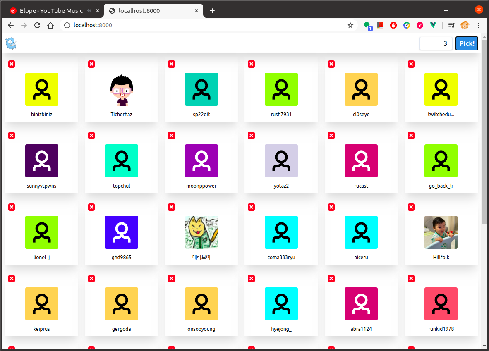

# Twitch-lotto

A simple lottery service for my twitch followers.

> Based on [golangkorea/lotto](https://github.com/golangkorea/lotto), lottery for Meetup members

## Run

```shell
git clone https://github.com/suapapa/twitch-lotto
cd twitch-lotto
go build
source ./twitch_env.sh # FIX THIS TO YOUR CLIENT_ID AND CLIENT_SECRET
./twitch-lotto -f twitch
```

Then visit `http://127.0.0.1:8000`.

## Example



## License

MIT
